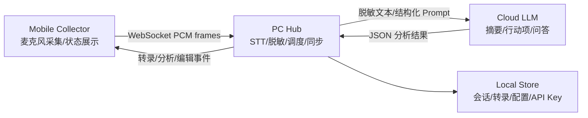

# AI Minutes 技术方案

## 1. 总体架构

AI Minutes 采用端-边-云三级架构：



### 1.1 端 Mobile

- 使用麦克风采集音频，MVP 使用浏览器 `MediaRecorder` 采集 `webm/opus` 帧。
- 后续原生 App 可切换为 PCM16 mono 16 kHz 或 AAC-LC。
- 通过 WebSocket 与 PC Hub 保持双向通信。
- 展示连接状态、实时转录、阶段性摘要和云端分析状态。
- 本地维护短时发送队列，断线后自动重连并补发尚未确认的数据。

### 1.2 边 PC Hub

- 提供局域网 WebSocket 服务，接收音频帧。
- 会话级事件总线：音频帧、转录段、摘要、问答、编辑同步都统一为事件。
- STT 通过可插拔接口实现，MVP 使用 mock transcriber，生产接入 Faster-Whisper。
- 脱敏模块在发送云端前处理文本，支持正则规则和自定义词典。
- LLM Gateway 统一管理 OpenAI、Claude、文心一言等供应商。
- API Key 存储在本地加密配置中，绝不发送给移动端。

### 1.3 云 Cloud Brain

- 接收 PC Hub 发送的脱敏文本窗口。
- 生成阶段性摘要、最终会议纪要、Action Items、决策记录。
- 智能问答使用会话转录索引作为 RAG 上下文。

## 2. MVP 范围

第一阶段目标是跑通最小闭环：

1. 手机浏览器打开 Collector 页面。
2. 输入 PC Hub WebSocket 地址并连接。
3. 点击录音，音频帧实时发送至 Hub。
4. Hub 接收音频帧并广播 mock 转录段。
5. Collector 实时显示转录内容和连接状态。

不在第一阶段实现：

- 真实 Faster-Whisper 推理。
- 发言人分离。
- 云端 LLM 真实调用。
- PDF/Notion/Obsidian 导出。

## 3. 模块划分

```text
apps/
  hub/
    app/
      main.py              FastAPI 入口
      core/config.py       环境变量与运行配置
      models/events.py     WebSocket 事件模型
      services/
        session.py         会话与客户端管理
        transcriber.py     STT 抽象与 mock 实现
        redaction.py       脱敏规则
        llm_gateway.py     云端分析接口占位
  mobile/
    src/
      App.tsx              移动采集器 UI
      audio.ts             麦克风采集封装
      ws.ts                WebSocket 客户端
```

## 4. 数据流

1. Mobile 创建 `client_hello`，声明设备信息与音频格式。
2. Hub 返回 `session_state`，包含会话 ID、连接状态和隐私模式。
3. Mobile 推送二进制音频帧。
4. Hub 将音频帧交给 STT 服务。
5. STT 输出 `transcript_delta`。
6. Hub 广播 `transcript_delta` 给所有连接端。
7. Hub 每 3-5 分钟聚合文本，脱敏后调用 LLM Gateway。
8. LLM Gateway 返回 `analysis_update`。
9. Hub 存储并广播分析结果。

## 5. 性能策略

- 音频帧建议 100-250 ms 一帧，避免过小帧导致 WebSocket 压力过高。
- Faster-Whisper 使用流式窗口，按 1-3 秒音频块增量推理。
- Hub 内部广播使用异步队列，防止 STT 推理阻塞网络收发。
- 云端摘要按文本窗口增量发送，默认 3 分钟或 1200 字触发一次。

## 6. 安全与隐私

- 默认仅 Hub 持有云端 API Key。
- `LOCAL_ONLY=true` 时关闭所有 LLM 调用。
- 发送云端前执行脱敏，默认遮蔽手机号、邮箱、身份证号和自定义词。
- 原始音频默认不落盘；如开启录音归档，则写入本地加密目录。

## 7. 后续演进

- 将浏览器 Collector 替换或并行为 React Native/Expo App。
- 接入 Faster-Whisper，提供 GPU/CPU 自动选择。
- 接入 pyannote 或本地 embedding 聚类完成 diarization。
- 增加 SQLite + SQLCipher 存储。
- 增加 Prompt 插件目录与插件 manifest。

